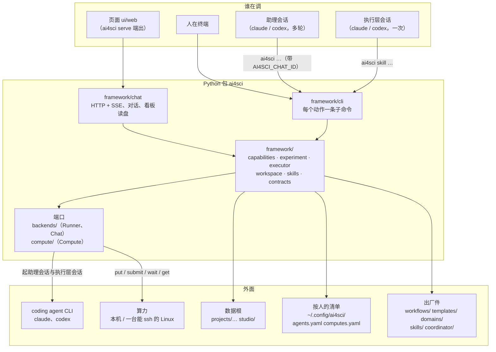

<h1 align="center">tju-ai4science-platform</h1>

<p align="center">TJU AI for Science · 生产代码仓</p>

## 这是什么

科研全自动化平台的生产代码：一个研究者在页面上跟助理说清课题、确认需求，助理照流程调用框架的能力做设计、实验、分析、验证，人只在断点上确认。四层：协调层（人 + 助理）做科研判断；框架是零模型的诚实执行基底（开门、开产出目录、封评分脚本、跑打分、记账、判冻结与签字）；执行层 coding agent 是唯一写代码的；skill 脚本是确定性工具。

产品纲领（P-1 到 P-25）、流程细则、未决问题与案例卡在外层协作仓 [`tju-ai4science`](https://github.com/zephyr4123/TJU-AI4Science) 的 `docs/`（那边的 README 是产品侧的地图）；本仓由它的 `./repos clone all` 拉到 `platform/` 目录下。这份是代码侧的地图。

## 系统一眼看



后端的分层与依赖方向、模式、异常、环境变量在 `framework/README.md`；前端在 `ui/README.md`；测试在 `tests/README.md`。

## 文档地图

| 你要 | 读 | 讲什么 |
|---|---|---|
| 改任何代码前 | [`CLAUDE.md`](CLAUDE.md) | 协作纪律、编码标准、质量纪律、红线（各带机器判据）、「改哪层先读哪份」 |
| 开分支、开 PR、发版 | [`CONTRIBUTING.md`](CONTRIBUTING.md)（清单）→ 外层 `CONTRIBUTING.md`（流程） | 分支模型、PR 合并前清单、1.x 冻结的契约、rc 预发布 |
| 改后端（`framework/` `backends/` `compute/`） | [`framework/README.md`](framework/README.md) | 分层与依赖方向、技术栈、在用的模式与约定、异常与退出码、环境变量总表、已知盲点 |
| 写或改测试 | [`tests/README.md`](tests/README.md) | 目录与命名、夹具、三种写法、live 门控、门禁 |
| 改页面（`ui/web/`） | [`ui/README.md`](ui/README.md) | 契约、技术栈、代码约定、测试政策、浏览器闭环 |
| 页面给谁用、长什么样 | [`docs/PRODUCT.md`](docs/PRODUCT.md)、[`docs/DESIGN.md`](docs/DESIGN.md) | 用户与原则；视觉、布局、组件、动效、素材 |
| 加一个步骤 / skill / 领域包 | [`docs/add-a-capability.md`](docs/add-a-capability.md)、[`docs/add-a-skill.md`](docs/add-a-skill.md)、[`docs/add-a-domain.md`](docs/add-a-domain.md) | 照做就能接进来的手册，各有验收标准 |
| 在终端里接一个课题 | [`docs/start-a-workspace.md`](docs/start-a-workspace.md) | 目录、需求、原件、设计、跑起来、常见报错 |
| 改助理的行为 | [`coordinator/README.md`](coordinator/README.md)、[`coordinator/studio.md`](coordinator/studio.md) | **线上 prompt**：研究助理、流程助理的指南；执行层的 prompt 在各能力子包的 `prompt.md` |
| 端点与响应体 | `framework/chat/server.py` 文件头、`framework/chat/boards.py` | 唯一出处，文档不抄 |
| 命令清单 | `ai4sci --help` | 唯一出处 |
| 产品为什么这样 | 外层 `docs/architecture/README.md`、`workflow.md` | 纲领与细则 |
| 变更 | [`CHANGELOG.md`](CHANGELOG.md) | 每个改动合并时写进 Unreleased |

## 目录

```
platform/
├── framework/     Python 包 ai4sci：契约、工作区、能力、对话与页面后端、CLI；零模型调用（规矩见 framework/README.md）
├── backends/      agent 适配器：claude_code.py、codex.py（执行层 + 协调层 + 自检各一份）
├── compute/       算力适配器：local.py 本机、ssh.py 一台能 ssh 上去的 Linux（按人的清单 ~/.config/ai4sci/computes.yaml 选）
├── coordinator/   两位助理的指南（线上 prompt）：README.md 项目里的研究助理、studio.md 编辑台的流程助理
├── domains/       领域包：generic/ 兜底、petab/ 参数估计（docs/add-a-domain.md）
├── skills/        skill 库：pdf/ 解析论文、download/ 拉材料（docs/add-a-skill.md）
├── workflows/     出厂的流程：research（改进）、reproduce（论文复现），只读；人在编辑台存的在数据根 studio/workflows/，两层合起来是库，工作区取实例
├── templates/     需求模板库：generic / ai / cs / materials / reproduce
├── projects/      数据根（源码模式）：一个项目一位助理，样例三个单工作区项目 mlp-regression、boehm-nll、rahman-nll
├── ui/            界面层：web/ 网页（React + Tailwind + shadcn；规矩见 ui/README.md），tui/ 留位置
├── docs/          手册：start-a-workspace / add-a-capability / add-a-skill / add-a-domain；PRODUCT.md、DESIGN.md
├── tests/         框架测试（怎么写见 tests/README.md）
├── Makefile       up / check / venv / lock / lint / skills / test / ui / ui-check / package / release / clean / purge
├── CLAUDE.md      规矩；AGENTS.md 是它的符号链接（Codex 的入口）
├── CONTRIBUTING.md PR 合并前的清单；流程在外层仓
└── CHANGELOG.md
```

工作区的根是需求（纲领 P-19）：`requirement.md` 由人和助理对话后由助理按模板写，人确认（`requirement.lock`）之后阶段才开工，这是框架唯一内置的门。七个阶段各一个目录，每次执行一个编号子目录 `<stage>/<n>/`，`meta.yaml` 记它读了哪几次产出（`from`，带 sha256）、在哪台机器上跑、执行层用的哪家；被下游引用或人签过字的产出就冻结。断点由拼流程的人定：一个断点 = 上一项的产出要人签字下游才能读，零个断点就是全自动。命令行上有什么以 `ai4sci --help` 为准；命令不带路径，助理站在项目里、工作区级的命令带 `--ws <名字>`，人在终端 cd 进工作区就不用带。

## 怎么跑

两种人两条路。

**只用**：装 Release 里的 wheel，不 clone、不装 node、不设环境变量。前提只有 uv 和你要用的那家 coding agent CLI（claude 或 codex，登录好）。

```bash
curl -LsSf https://astral.sh/uv/install.sh | sh                   # 装 uv（一次）
uv tool install https://github.com/zephyr4123/TJU-AI4Science-Platform/releases/download/vX.Y.Z/ai4sci-X.Y.Z-py3-none-any.whl
ai4sci check                                # 底座（哪家 CLI 装了、登录了）、算力、存放，一行一项
ai4sci serve                                # 起服务，浏览器开 http://127.0.0.1:8765
```

包里自带页面、流程、模板、skill、领域包、指南；数据落在 `~/ai4sci`（要放别处设 `AI4SCI_HOME`）；接机器、换底座都在页面「设置」里或对话里跟助理说。

**改代码**：clone 仓库，前提是 uv + node 22 + git。

```bash
make up                                     # 一行起：.venv（uv.lock）→ 页面 → skill 预热 → ai4sci check → ai4sci serve
make check                                  # 门禁：CHANGELOG + ruff + skills + pytest + 页面，与 CI 完全相同
make lock                                   # 改了 pyproject 的依赖后重钉 uv.lock
make clean                                  # 删仓里装出来的：.venv、node_modules、页面构建；不碰配置、登录、数据
AI4SCI_LIVE=1 make test                     # 连真 CLI 的冒烟测试，会花钱，CI 不跑
AI4SCI_LIVE_SSH=<名字> make test             # 连清单里那台真机器的算力测试，CI 不跑
make package VERSION=X.Y.Z                  # 出 wheel（含页面与出厂件）+ sdist + sha256 到 dist/
```

仓库里跑，出厂件在仓根、数据根不设就是仓根（样例项目在 `projects/`）；装的包跑，出厂件在包里 `framework/shipped/`、数据根 `~/ai4sci`——分辨在 `framework/paths.py` 一处。

## 在终端里走一遍

样例项目已确认需求、已有 `design/1`。人在终端当协调层，框架不连跑，一条命令一步（下面省略 `.venv/bin/` 前缀）：

```bash
cd projects/mlp-regression && ../../.venv/bin/ai4sci show project   # 每个工作区一行：需求状态、流程走到哪、在等谁
cd workspaces/mlp-regression                                     # cd 进工作区就不用 --ws
ai4sci flow take research                                        # 库里的流程取成实例 flows/research.yaml
ai4sci sign design/1 --note "评分脚本算的是我要的数"               # 断点：人签字，下游才能读它
ai4sci cap auto-research --from design/1 --max-iters 5 --detach  # 开 experiment/1，一轮一轮改；后台作业，show job 看进度
ai4sci cap analysis --from experiment/1                          # 执行层写 analysis/1/analysis.md
ai4sci cap verify --from analysis/1 --from experiment/1          # 零模型核对数字 → verification/1，退出码就是 PASS / FAIL
ai4sci show caps                                                 # 七个阶段、每个阶段的能力与五栏；show workflows 列流程
```

助理与执行层各用哪家 coding agent、每家新对话用的模型与思考深度，是使用者自己的设置（纲领 P-25）：`~/.config/ai4sci/agents.yaml`，`ai4sci agent list | check | use` 维护，页面「设置」是同一份。超时与额度走环境变量（清单见 `framework/README.md` §5）。课题跑在自己的环境里：`cap design` 把 `materials/env/` 带进设计那包，实验按它建自己的 venv，harness 只经 `$AI4SCI_PYTHON` 起解释器，平台 venv 一个包不多装。接一个新课题看 [`docs/start-a-workspace.md`](docs/start-a-workspace.md)。

## 版本与发布

从 1.0.0 起承诺兼容（冻结的契约与判据在外层 `CONTRIBUTING.md`「版本与发布」）。

1. 每个 PR 在 `CHANGELOG.md` 的 Unreleased 加一行。
2. 正式版在 `main` 上 `make release VERSION=x.y.z`：轮转 CHANGELOG、提交、打 tag，不 push；预发布在 `release/X.Y` 上 `make release VERSION=x.y.z-rc.N`，只打 tag。
3. 推 tag 触发 GitHub Release 出 wheel，rc 自动标 pre-release。
