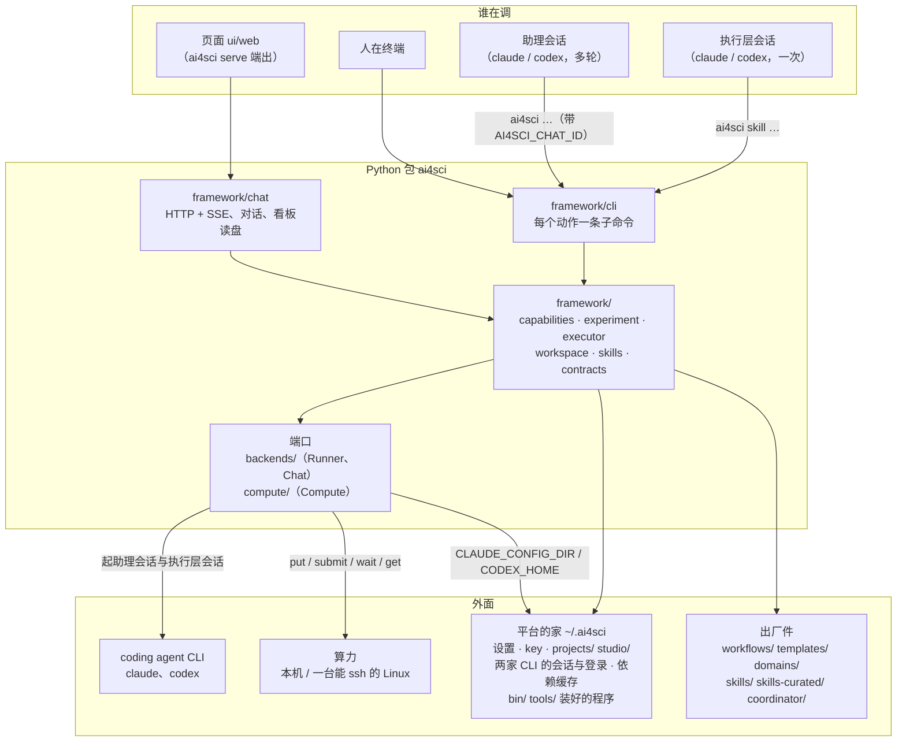

<h1 align="center">tju-ai4science-platform</h1>

<p align="center">TJU AI for Science · 生产代码仓</p>

## 这是什么

科研全自动化平台的生产代码：一个研究者在页面上跟助理说清课题、确认需求，助理照流程调用框架的能力做设计、实验、分析、验证，人只在断点上确认。四层：协调层（人 + 助理）做科研判断；框架是零模型的诚实执行基底（开门、开产出目录、封评分脚本、跑打分、记账、判冻结与签字）；执行层 coding agent 是唯一写代码的；skill 脚本是确定性工具。

产品纲领（P-1 到 P-27）、流程细则、未决问题与案例卡在外层协作仓 [`tju-ai4science`](https://github.com/zephyr4123/TJU-AI4Science) 的 `docs/`（那边的 README 是产品侧的地图）；本仓由它的 `./repos clone all` 拉到 `platform/` 目录下。这份是代码侧的地图。

## 系统一眼看


```mermaid
flowchart TB
  subgraph CLIENTS["谁在调"]
    direction LR
    UI["页面 ui/web<br/>（ai4sci serve 端出）"]
    TERM["人在终端"]
    AST["助理会话<br/>（claude / codex，多轮）"]
    EXE["执行层会话<br/>（claude / codex，一次）"]
  end
  subgraph PKG["Python 包 ai4sci"]
    direction LR
    SRV["framework/chat<br/>HTTP + SSE、对话、看板读盘"]
    CLI["framework/cli<br/>每个动作一条子命令"]
    CORE["framework/<br/>capabilities · experiment · executor<br/>workspace · skills · contracts"]
    PORTS["端口<br/>backends/（Runner、Chat）<br/>compute/（Compute）"]
  end
  subgraph OUT["外面"]
    direction LR
    CC["coding agent CLI<br/>claude、codex"]
    MACH["算力<br/>本机 / 一台能 ssh 的 Linux"]
    HOME["平台的家 ~/.ai4sci<br/>设置 · key · projects/ studio/<br/>两家 CLI 的会话与登录 · 依赖缓存<br/>bin/ tools/ 装好的程序"]
    SHIP["出厂件<br/>workflows/ templates/ domains/<br/>skills/ skills-curated/ coordinator/"]
  end
  UI --> SRV
  TERM --> CLI
  AST -- "ai4sci …（带 AI4SCI_CHAT_ID）" --> CLI
  EXE -- "ai4sci skill …" --> CLI
  SRV --> CORE
  CLI --> CORE
  CORE --> PORTS
  PORTS -- "起助理会话与执行层会话" --> CC
  PORTS -- "put / submit / wait / get" --> MACH
  CORE --> HOME
  PORTS -- "CLAUDE_CONFIG_DIR / CODEX_HOME" --> HOME
  CORE --> SHIP
```

后端的分层与依赖方向、模式、异常、环境变量在 `framework/README.md`；前端在 `ui/README.md`；测试在 `tests/README.md`。

## 文档地图

| 你要 | 读 | 讲什么 |
|---|---|---|
| 改任何代码前 | [`CLAUDE.md`](CLAUDE.md) | 协作纪律、编码标准、质量纪律、红线（各带机器判据）、「改哪层先读哪份」 |
| 开分支、开 PR、发版 | [`CONTRIBUTING.md`](CONTRIBUTING.md)（清单）→ 外层 `CONTRIBUTING.md`（流程） | 分支模型、PR 合并前清单、1.x 冻结的契约、rc 预发布 |
| 改后端（`framework/` `backends/` `compute/`） | [`framework/README.md`](framework/README.md) | 分层与依赖方向、技术栈、在用的模式与约定、异常与退出码、环境变量总表、已知盲点 |
| 写或改测试 | [`tests/README.md`](tests/README.md) | 目录与命名、夹具、三种写法、live 门控、门禁 |
| 改页面（`ui/web/`） | [`ui/README.md`](ui/README.md) | 契约、技术栈、代码约定、测试政策、浏览器闭环 |
| 页面给谁用、长什么样 | [`docs/PRODUCT.md`](docs/PRODUCT.md)、[`docs/DESIGN.md`](docs/DESIGN.md) | 用户与原则；视觉、布局、组件、动效、素材 |
| 加一个步骤 / skill / 领域包 | [`docs/add-a-capability.md`](docs/add-a-capability.md)、[`docs/add-a-skill.md`](docs/add-a-skill.md)、[`docs/add-a-domain.md`](docs/add-a-domain.md) | 照做就能接进来的手册，各有验收标准 |
| 在终端里接一个课题 | [`docs/start-a-workspace.md`](docs/start-a-workspace.md) | 目录、需求、原件、设计、跑起来、常见报错 |
| 改助理的行为 | [`coordinator/README.md`](coordinator/README.md)、[`coordinator/studio.md`](coordinator/studio.md) | **线上 prompt**：研究助理、流程助理的指南；执行层的 prompt 在各能力子包的 `prompt.md` |
| 端点与响应体 | `framework/chat/server.py` 文件头、`framework/chat/boards.py` | 唯一出处，文档不抄 |
| 命令清单 | `ai4sci --help` | 唯一出处 |
| 产品为什么这样 | 外层 `docs/architecture/README.md`、`workflow.md` | 纲领与细则 |
| 变更 | [`CHANGELOG.md`](CHANGELOG.md) | 每个改动合并时写进 Unreleased |

## 目录

```
platform/
├── framework/     Python 包 ai4sci：契约、工作区、能力、对话与页面后端、CLI；零模型调用（规矩见 framework/README.md）
├── backends/      agent 适配器：claude_code.py、codex.py（执行层 + 协调层 + 自检各一份）
├── compute/       算力适配器：local.py 本机、ssh.py 一台能 ssh 上去的 Linux（按平台的家里那份 computes.yaml 选）
├── coordinator/   两位助理的指南（线上 prompt）：README.md 项目里的研究助理、studio.md 编辑台的流程助理
├── domains/       领域包：generic/ 兜底、petab/ 参数估计（docs/add-a-domain.md）
├── skills/        平台自带的 skill（常驻）：general/materials/ 下的 pdf 解析论文、download 拉材料（docs/add-a-skill.md）
├── skills-curated/ 收录的社区 skill：按 <架>/<tag>/ 分好（分类表 framework/skills/shelves.py），台账 provenance.yaml；挂到流程上才装载
├── workflows/     出厂的流程：research（改进）、reproduce（论文复现）、literature-survey（文献调研），只读；人在编辑台存的在平台的家里 studio/workflows/，两层合起来是库，工作区取实例
├── templates/     需求模板库：generic / ai / cs / materials / reproduce
├── ui/            界面层：web/ 网页（React + Tailwind + shadcn；规矩见 ui/README.md），tui/ 留位置
├── docs/          手册：start-a-workspace / add-a-capability / add-a-skill / add-a-domain；PRODUCT.md、DESIGN.md
├── tests/         框架测试（怎么写见 tests/README.md）
├── install/       一行命令：install.sh（Mac / Linux）、install.ps1（Windows 的槽，外层 #210）；发版时与 wheel、uv 一起传到 CDN（.github/scripts/cdn.py，外层 #277）
├── Makefile       up / check / venv / lock / lint / skills / test / ui / ui-check / package / release / clean / purge
├── CLAUDE.md      规矩；AGENTS.md 是它的符号链接（Codex 的入口）
├── CONTRIBUTING.md PR 合并前的清单；流程在外层仓
└── CHANGELOG.md
```

工作区的根是需求（纲领 P-19）：`requirement.md` 由人和助理对话后由助理按模板写，人确认（`requirement.lock`）之后阶段才开工，这是框架唯一内置的门。七个阶段各一个目录，每次执行一个编号子目录 `<stage>/<n>/`，`meta.yaml` 记它读了哪几次产出（`from`，带 sha256）、在哪台机器上跑、执行层用的哪家；被下游引用或人签过字的产出就冻结。断点由拼流程的人定：一个断点 = 上一项的产出要人签字下游才能读，零个断点就是全自动。命令行上有什么以 `ai4sci --help` 为准；命令不带路径，助理站在项目里、工作区级的命令带 `--ws <名字>`，人在终端 cd 进工作区就不用带。

## 怎么跑

两种人两条路。

**只用**：粘一行，什么都不用先装，全程国内源（Mac / Linux；Windows 在做，外层 #210）：

```bash
curl -fsSL https://media.zephyrxiang.com/ai4science/dist/install.sh | sh
```

它依次装 uv、Python、平台、Claude Code 与 Codex（装过的跳过），在终端里问 DeepSeek 的 key（[platform.deepseek.com](https://platform.deepseek.com) 申请；回车跳过，之后在页面「设置 → AI」里填）并当场问一句试通，然后起服务、开浏览器 <http://127.0.0.1:8765>。下次启动 `ai4sci serve`；哪里坏了再跑 `ai4sci setup`，装好的都跳过。为什么这样装、从哪下、装到哪见外层 `docs/specs/onboarding.md`（外层 #277）。

装出来的与用起来长出的一切都在**平台的家** `~/.ai4sci`（要放别处设 `AI4SCI_HOME`）：`bin/` 里的 `ai4sci` 进 PATH，`tools/` 下是平台本体、Python、两家 CLI；设置、key、项目、两家 CLI 的会话与平台自己的登录、依赖缓存也在这。落在外面的只有 shell 配置里一行 PATH（带 `# ai4sci`）；跑实验要 git，Mac 上缺了 `ai4sci setup` 会弹苹果的安装框。包里自带页面、流程、模板、skill、领域包、指南。清除在页面「设置 → 存放」或 `ai4sci reset`：删数据、设置、登录与缓存，装好的程序留着（回到刚装好的样子）；接机器、换底座都在页面「设置」里或对话里跟助理说。文献检索不要 key 也能跑；常用的话去 [openalex.org/settings/api](https://openalex.org/settings/api) 领一个免费 key，在页面「设置」里填进去，额度大十倍（纲领 P-27）。key 都存在平台的家里、只有你能读，不走环境变量。

**接谁的模型、怎么登录**（1.7 起，外层 #263）：平台用家里的私有目录起 CLI，**你自己终端里 `claude` / `codex login` 登的账号平台不认**。一行命令填的 DeepSeek key 两家都用上；换供应商在页面「设置 → AI」里选：用官方订阅的（要能访问外网），终端里跑 `ai4sci agent login claude_code`（或 `codex`），浏览器里授权后点「检查」；用 Kimi 这类的，在同一页粘贴 key。设置里「登录」那一行给的命令照抄就能跑。

**升级**：同一行命令再跑一遍：平台换成新版，CLI 低于平台要求的才换。以前用 `uv tool install` 装在缺省位置的，这一行会先把它卸掉、换成家里这份，终端里只剩一个 `ai4sci`（外层 #274）。改代码的拉代码再起（`git pull && make up`）。

**卸载**：删掉 `~/.ai4sci`，再删 shell 配置里带 `# ai4sci` 的那一行。

从 1.6 及以前升到 1.7：家搬到了 `~/.ai4sci`，官方账号要在平台里重新登录一次（上面那条命令）；旧的项目、编辑台、两份清单、对话记录用一行搬过来，不用 clone 外层仓。旧数据根：装 wheel 的是 `~/ai4sci`，源码跑的是仓库目录。先不加 `--apply` 看会搬什么，旧的一样不删：

```bash
uv run https://raw.githubusercontent.com/zephyr4123/TJU-AI4Science/main/scripts/oneoff/migrate-to-home-263.py ~/ai4sci
uv run https://raw.githubusercontent.com/zephyr4123/TJU-AI4Science/main/scripts/oneoff/migrate-to-home-263.py ~/ai4sci --apply
```

**改代码**：clone 仓库，前提是 uv + node 22 + git。

```bash
make up                                     # 一行起：.venv（uv.lock）→ 页面 → skill 门禁与预热 → ai4sci setup（git、两家 CLI、key，装过的跳过）→ 起服务
make check                                  # 门禁：CHANGELOG + ruff + skills + pytest + 页面，与 CI 完全相同
make lock                                   # 改了 pyproject 的依赖后重钉 uv.lock
make clean                                  # 删仓里装出来的：.venv、node_modules、页面构建；不碰配置、登录、数据
AI4SCI_LIVE=1 make test                     # 连真 CLI 的冒烟测试，会花钱，CI 不跑
AI4SCI_LIVE_SSH=<名字> make test             # 连清单里那台真机器的算力测试，CI 不跑
make package VERSION=X.Y.Z                  # 出 wheel（含页面与出厂件）+ sdist + sha256 到 dist/
```

仓库里跑，出厂件在仓根；装的包跑，出厂件在包里 `framework/shipped/`。两种跑法的家都是 `~/.ai4sci`：设置、key、项目、两家 CLI 的会话记录与平台自己的登录、依赖缓存都在里面（一行命令装的还有 `bin/` `tools/`），平台不写你自己的 `~/.claude`、`~/.codex`（外层 #263）。位置只在 `framework/paths.py` 一处给。

## 在终端里走一遍

页面上是助理和你对话、替你敲这些命令；人在终端当协调层也行，框架不连跑，一条命令一步（下面省略 `.venv/bin/` 前缀）：

```bash
ai4sci project new mlp-demo --title "小 MLP 回归"                 # 在平台的家里起项目：~/.ai4sci/projects/mlp-demo/
cd ~/.ai4sci/projects/mlp-demo
ai4sci workspace new mlp --template ai                           # 起一个工作区，照模板起草 requirement.md
cd workspaces/mlp                                                # cd 进工作区就不用 --ws；课题的代码与数据放进 materials/
ai4sci requirement confirm                                       # 需求写清后人确认：框架唯一内置的门
ai4sci flow take research                                        # 取一条流程实例；项目只跑实例上挂的能力（P-26）
ai4sci cap design                                                # 开 design/1：评分脚本、基线
ai4sci sign design/1 --note "评分脚本算的是我要的数"               # 断点：人签字，下游才能读它
ai4sci cap auto-research --from design/1 --max-iters 5 --detach  # 开 experiment/1，一轮一轮改；后台作业，show job 看进度
ai4sci cap analysis --from experiment/1                          # 执行层写 analysis/1/analysis.md
ai4sci cap verify --from analysis/1 --from experiment/1          # 零模型核对数字 → verification/1，退出码就是 PASS / FAIL
ai4sci show project                                              # 每个工作区一行：需求状态、流程走到哪、在等谁
```

助理与执行层各用哪家 coding agent、每家新对话用的模型与思考深度，是使用者自己的设置（纲领 P-25）：平台的家里的 `agents.yaml`，`ai4sci agent list | check | use` 维护，页面「设置」是同一份。超时与额度走环境变量（清单见 `framework/README.md` §5）。课题跑在自己的环境里：`cap design` 把 `materials/env/` 带进设计那包，实验按它建自己的 venv，harness 只经 `$AI4SCI_PYTHON` 起解释器，平台 venv 一个包不多装。接一个新课题看 [`docs/start-a-workspace.md`](docs/start-a-workspace.md)。

## 版本与发布

从 1.0.0 起承诺兼容（冻结的契约与判据在外层 `CONTRIBUTING.md`「版本与发布」；内测期不兼容也走 MINOR，迁移办法写进 CHANGELOG，例外的条件也在那里）。

1. 每个 PR 在 `CHANGELOG.md` 的 Unreleased 加一行。
2. 正式版在 `main` 上 `make release VERSION=x.y.z`：轮转 CHANGELOG、提交、打 tag，不 push；预发布在 `release/X.Y` 上 `make release VERSION=x.y.z-rc.N`，只打 tag。
3. 推 tag 触发 GitHub Release 出 wheel，rc 自动标 pre-release。
