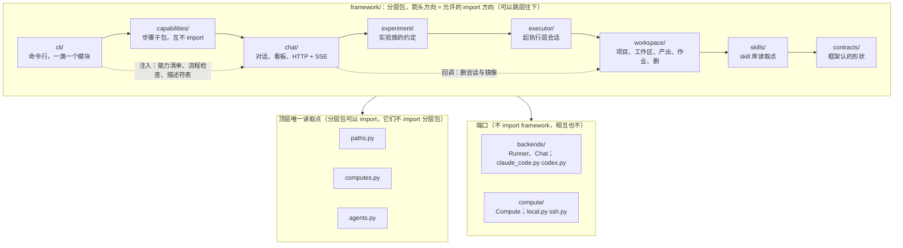
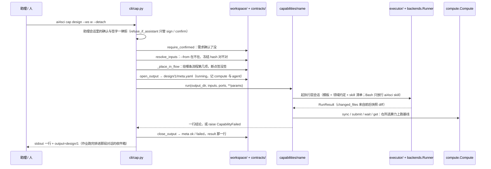
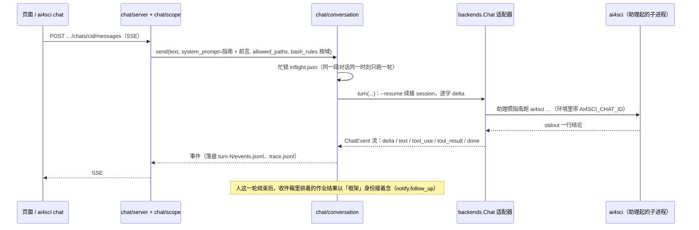

# framework/ · 后端的规矩

给改 `framework/`、`backends/`、`compute/` 的人和 agent 读。这份只写代码层面的事：分层与依赖方向、技术栈、在用的模式与约定、异常与退出码、配置从哪来、测试怎么配合。产品边界与原则在外层 `docs/architecture/README.md`，流程细则在 `docs/architecture/workflow.md`，仓级红线在 `CLAUDE.md`。写法上每条都指到文件，说不出出处的规矩不写。

## 1. 分层与依赖方向

Python 包 `ai4sci`，入口 `framework.cli:main`。`framework/` 内八层，依赖**只许自上而下**，同层与包内随意（`tests/test_layering.py` 用 ast 逐条查，`from framework import cli` 这种写法也查）：

```
cli → capabilities → chat → experiment → executor → workspace → skills → contracts
```



| 子包 | 放什么 | 出处 |
|---|---|---|
| `contracts/` | 框架认的东西的形状，只有这几样：七个研究阶段（`stages`）、需求与确认（`requirement`）、产出目录与签字（`output`：`meta.yaml`、`signed.json`、tree hash）、流程文件（`workflows`）、能力描述符与入口形状（`capability`：`Capability` / `Inputs` / `Param` / `Ports`，文案的字数与禁用词断言） | 谁都不 import |
| `skills/` | skill 库的读取点：扫两处库、校验 SKILL.md 与脚本、拼 `<available_skills>`、`uv run` 起脚本 | `library.py` `catalog.py` `run.py` |
| `workspace/` | 项目与工作区的磁盘：`project`（`project.md`）、`root`（`requirement.md`、七个阶段目录、`.ai4sci/`）、`outputs`（`<stage>/<n>/` 的开与收、冻结判断、跨工作区引用）、`progress`（流程实例走到哪，从 meta 现算）、`jobs`（后台作业）、`removal`（删，拒的条件在文件头） | |
| `executor/` | 起执行层会话：`prompting` 组提示（模板 + 领域约定 + skill 清单 + 联网规矩）、`session` 起会话留档（Bash 只放行 `ai4sci skill`） | |
| `experiment/` | 实验这一族能力私下的约定：设计那包合不合约（`pack`）、`env`（`env/` 与 uv venv、保证给 harness 的环境变量）、`headroom` 预检、`layout` 实验目录布局、`checkpoint` `ledger` `notebook` `artifacts` `results` `analysis` `report`、`drafting` 起执行层写草稿、`baseline` 跑基线、`harness_contract.md` 给执行层的 harness 约定；`schemas/` 三份 JSON Schema | 契约层不认识它（纲领 P-19） |
| `chat/` | 两位助理与页面后端：`scope` 定域（可写目录、指南、命令前缀）、`guide` 注入指南与前言、`conversation` 一段对话（落盘、忙锁、收件箱）、`notify` 作业跑完排进收件箱、`boards` 看板读盘、`settings` 设置、`removal` 目录外的删（会话、镜像）、`server` 标准库 HTTP + SSE（端点清单在文件头） | |
| `capabilities/` | 能力库的「步骤」那一半：一个步骤一个子包，互不 import，各导出 `DESCRIPTOR` 与 `run(output_dir, inputs, ports, **params)`；`discover()` 扫目录并断言签名；`abilities.py` 是能力库的出处（步骤 + skill 两个 tag）；`MAIN_FILES` 阶段主文件表 | 现有六个：`design` `reproduction` `auto_research` `analysis` `reproducibility` `verify` |
| `cli/` | 命令行，一类一个模块，`__init__.py` 逐行装配（没有注册表，加一条就加一行）；`_common.py` 退出码、当前项目与工作区、按名字取端口、`refuse_if_assistant` | 清单以 `ai4sci --help` 为准 |

分层之外的三个顶层模块是**唯一读取点**：`paths.py`（仓根、出厂件、数据根、五个 `*_ROOT` 环境变量）、`computes.py`（`~/.config/ai4sci/computes.yaml`）、`agents.py`（`agents.yaml`）。分层包可以 import 它们，它们不许 import 分层包。

两个**端口**在包外：`backends/`（`Runner` 执行层一次会话、`Chat` 协调层多轮续接，两个 Protocol；适配器 `claude_code.py`、`codex.py` 各一个文件，`_procs.py` 杀进程树、`_snapshot.py` 前后快照 diff）与 `compute/`（`Compute` Protocol；`local.py`、`ssh.py`）。端口不 import framework，相互也不 import；按名字取适配器走显式字典 `_BACKENDS` / `_COMPUTES`，名字不对抛 `BackendNotFound` / `ComputeNotFound`，绝不回退。

下层要用上层的东西怎么办：**由上层注入函数或回调**，不反向 import。`chat/server.py` 不认识 `capabilities`，能力清单、流程检查、描述符表由 `cli/serve.py` 以函数传进 `ChatServer`；`workspace/removal.py` 通过回调接 `chat/removal.py`。

两种跑法只在 `paths.py` 分辨：仓根有 `pyproject.toml` 就是源码模式（出厂件在仓根、数据根缺省仓根），否则是装的包（出厂件在 `framework/shipped/`，数据根 `~/ai4sci`）。

## 2. 技术栈

| 层 | 用什么 | 为什么 |
|---|---|---|
| 语言 | Python ≥ 3.12（`pyproject.toml`），本机与 CI 3.14；全部文件 `from __future__ import annotations` | |
| 运行时依赖 | 只有 `pyyaml`、`jsonschema`、`uv`（`python -m uv` 调用） | 框架零模型调用、单人本机服务，标准库够用；加一个依赖要说清为什么标准库不够，并过「四看」（维护活跃度、社区规模、许可证、安全记录） |
| CLI | `argparse`，`cli/__init__.py` 逐行装配 | 没有注册表，diff 里一眼看到加了什么 |
| HTTP | 标准库 `ThreadingHTTPServer` + 手写 SSE（`chat/server.py`） | 四十来个端点、本机单人，不值得引 web 框架 |
| 配置文件 | YAML 一律 `safe_load`；JSON Schema Draft 2020-12（`experiment/schemas/`） | |
| 提示模板 | `string.Template`（`executor/prompting.py`）：占位符缺一个就 KeyError | 不静默留一个 `$xxx` 在提示里 |
| 能力发现 | `pkgutil` + `inspect` 断言（`capabilities/__init__.py`） | 签名不对当场炸 |
| 环境 | uv 管一切：`uv.lock`、`make venv` = `uv sync --locked`；dev 工具走 PEP 735 dependency-groups；skill 脚本 PEP 723 + `uv lock --script`；课题的依赖按 `materials/env/` 每次实验自建 venv | 红线：依赖不装全局，课题依赖不进平台 venv |
| 构建 | setuptools + setuptools-scm，版本从 tag 读；`make package` 把出厂件拷进 `framework/shipped/` 再 `uv build` | |
| 静态检查 | ruff：`E F W B I BLE UP`，行宽 100（`BLE` 是「不吞异常」的机器判据） | |
| 测试 | pytest，剧本后端代替 mock（见 `tests/README.md`） | |
| 外部命令 | git、ssh / rsync、ruff（查执行层写的 harness）、pgrep | |
| agent CLI | Claude Code ≥ 2.1.276（隔离参数 `--setting-sources "" --strict-mcp-config --disable-slash-commands`）、Codex 按 0.147.0 实测（私有 `CODEX_HOME` 隔离）；实测清单只记在各自适配器的文件头 | |

## 2b. 两条主路径

一条能力调用（`ai4sci cap …`，`cli/cap.py`）从门到收尾：



一轮对话（页面或终端 → 助理 → 它调用的命令）：



## 3. 在用的模式与约定

- **端口 + 适配器，策略靠显式字典**（`backends/__init__.py`、`compute/__init__.py`）：`Protocol` 定形状，一家一个文件，`_BACKENDS` 里加一行就是加一家。框架里不出现某家 CLI 的名字或参数；选哪家来自 `agents.yaml` 的 `chat` / `executor` 角色。
- **能力即插件**（`capabilities/__init__.py`）：子包导出 `DESCRIPTOR: Capability` 与 `run(output_dir, inputs, ports, *, <params>) -> str`；成功返回一行结论，失败 `raise CapabilityFailed`；CLI 选项、页面节点、`show caps` 都从描述符生成。描述符的文案由 `__post_init__` 断言：`title` ≤ 8 字、`brief` ≤ 30 字、五栏必填、不含 `BANNED_WORDS`、不写 `--` 参数（`contracts/capability.py`）。
- **文件即接口、状态现算**：框架只认 `meta.yaml`、`signed.json`、`requirement.md` / `.lock`、`flows/<name>.yaml`、`.ai4sci/jobs/<id>.json`；产出 id 就是路径；进度与「在等谁」从 meta 现算（`workspace/progress.py`），没有进度文件。
- **冻结靠 hash**：产出被引用（`from` 记 tree hash）或被签（`signed.json` 记 hash）之后再改就拒读、签字作废；需求 lock 同样按 sha256（`contracts/output.py`、`workspace/outputs.py`、`contracts/requirement.py`）。平台记录（`.ai4sci/`、`meta.yaml`、`signed.json`、`.venv`、`.git`）不算进 hash（`HASH_IGNORED`）。
- **fail-closed**：未知的值写 NaN 或空，绝不写 0 冒充（`RunResult.cost_usd`、账本）；配置非法当场断言或抛，不回落；要的机器不可用报错，绝不静默退回本机。
- **用户输入错误返回问题清单，程序缺陷照常抛**：盘上东西不合约（坏 yaml、缺文件）→ 一行一条、带文件与「期望 vs 实际」的清单（`experiment/pack.py::validate_pack`、`contracts/workflows.py::workflow_problems`）；代码 bug → 异常带栈。
- **CLI 与 HTTP 调同一个函数**（`chat/boards.py` 同时服务 `show` 与端点），页面是端点的客户端，换界面后端不改。
- **人的动作只有人能做**：`requirement confirm` 与 `sign` 在带 `AI4SCI_CHAT_ID` 的环境里（助理的会话）一律拒（`cli/_common.py::refuse_if_assistant`）；流程助理连 `cap` 的命令前缀都不放行（`chat/guide.py::bash_rules`）。
- **原子写与锁**：写文件 tmp + `os.replace`；对话忙锁用 `O_EXCL` 并记 pid（`chat/conversation.py`）。
- **执行层改了什么只信前后快照 diff**（`backends/_snapshot.py`），不采信 CLI 自报；越界在事后判。
- **回调注入代替反向 import**（见 §1）。
- **有第二个用例才抽象**：两个能力或两个端口要共用小工具时先各写一份（`kill_tree` 有两份）；共用的读写只在族包（`experiment/`）里。
- **一个概念一处读取点**：根目录只在 `paths.py`，按人的两份清单只在 `computes.py` / `agents.py`，每个环境变量只读一次、断言一次。

命名与注释：

- 阶段中文名与英文 slug 只在 `contracts/stages.py` 换算；id 形如 `[a-z][a-z0-9-]*`；常量后缀 `*_NAME` / `*_DIRNAME` / `*_ENV`；公开面用 `__all__`；值对象 `dataclass(frozen=True)`。
- docstring 与注释用中文，写「为什么」，引用纲领条目 P-n 与 issue 号；文件头一段说清这个模块管什么、不管什么、坑在哪。
- 子包名下划线，命令名连字符（`auto_research/` → `ai4sci cap auto-research`）。

## 4. 异常、退出码、日志

| 层 | 约定 |
|---|---|
| 异常 | `ValueError` 输入非法、`FileNotFoundError` 不存在、`RuntimeError` 运行失败；各模块定自己的子类（`CapabilityFailed`、`OutputChanged`、`ConfirmRefused`…）。裸 `except` 与不 raise 的 `except Exception` 过不了 ruff；唯一一处 `except Exception`（`cli/cap.py`）是记失败后再 raise |
| CLI 退出码 | 0 通过；1 没通过（原因一行一条到 stderr）；2 用法错误（目录不存在、名字对不上） |
| stdout | 只留给协调层读的那一行结论：`ok <id>\t键=值…\tnext=<下一条命令>`，其余走 stderr（`cli/_common.py::setup_logging`） |
| HTTP | `ValueError` → 422（盘上东西不合约，一句话）、`OSError` → 500；另有 400 / 404 / 409（在跑、被引用）/ 403（出厂的不能删）（`chat/server.py`） |
| 日志 | logger 名 `ai4sci.<模块>`，消息是「snake_case 事件名 键=值 …」，走 stderr；错误日志要带定位信息（路径、id、原因） |

## 5. 配置与环境变量

配置归环境变量与按人的两份 YAML，命令上不带（纲领 P-14）。每个变量只有一个读取点：

| 变量 | 读取点 | 意思 |
|---|---|---|
| `AI4SCI_HOME` | `paths.py` | 数据根（项目、编辑台对话）；不设：源码模式仓根、包模式 `~/ai4sci` |
| `AI4SCI_WORKFLOWS_ROOT` `AI4SCI_DOMAINS_ROOT` `AI4SCI_TEMPLATES_ROOT` `AI4SCI_SKILLS_ROOT` | `paths.py` | 四种出厂件库的位置；指向的不是目录当场炸 |
| `AI4SCI_PROJECT` | `workspace/project.py` | 当前项目（不设从 cwd 往上找 `project.md`） |
| `AI4SCI_COMPUTES` `AI4SCI_AGENTS` | `computes.py` `agents.py` | 两份按人的清单的位置（缺省 `~/.config/ai4sci/`） |
| `AI4SCI_CHAT_ID` | `workspace/jobs.py`、`cli/_common.py`；适配器 `build_env` 设 | 调命令的那段对话：作业记下来，跑完把结果排进它的收件箱；人的动作据此拒助理 |
| `AI4SCI_JOB_ID` | `workspace/jobs.py` | 子进程凭它知道自己是哪个作业 |
| `AI4SCI_COORDINATOR_TIMEOUT_S` `_MAX_TURNS` `_MAX_BUDGET_USD` | `chat/conversation.py` | 协调层一轮的上限 |
| `AI4SCI_EXECUTOR_TIMEOUT_S` `_MAX_TURNS` `_MAX_BUDGET_USD` | `executor/session.py` | 执行层一次会话的上限 |
| `AI4SCI_ENV_BUILD_TIMEOUT_S` | `experiment/env.py` | 建课题 venv 的超时 |
| `AI4SCI_PYTHON` `AI4SCI_BUDGET_S` `AI4SCI_INNER_K` `AI4SCI_START_EPOCH` | `experiment/env.py`（框架**保证**给 harness） | harness 拿不到必须停，写默认值判不合法；`AI4SCI_SEED` 是唯一允许缺省的 |
| `AI4SCI_CODEX_HOME` | `backends/codex.py` | Codex 的私有 home |
| `UV_CACHE_DIR` | `paths.py` | uv 缓存（skill 脚本的环境在这） |

模型、思考深度、哪家 agent 归 `~/.config/ai4sci/agents.yaml`（`ai4sci agent use`），算力归 `computes.yaml`（`ai4sci compute add`）；两份都不进 git、不进数据根。测试里两份都指到 tmp（`tests/conftest.py`）。

## 6. 已知盲点

- `tests/test_layering.py` 判的是 import 语句，不是运行时依赖；函数体内的延迟 import 同样会被扫到，但字符串形式的 `importlib.import_module("framework.cli")` 看不到。
- 前后端契约（`chat/boards.py` 的响应体 ↔ `ui/web/src/api/types.ts`，`server.py::API_ROOTS` ↔ `vite.config.ts::API_PREFIXES`）只靠注释同步；`tests/test_chat_server.py` 只查页面读的响应体里凡 id / name / slug 必带 title / label。
