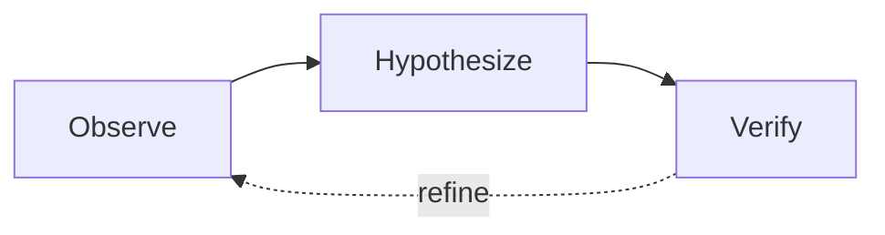

# Diagram Generation Guide (TikZ / Mermaid)

Deterministic, LaTeX-native diagrams for papers.

## TikZ (LaTeX-native diagrams)

Use when the diagram is simple enough for deterministic output:

```latex
\begin{tikzpicture}[
    box/.style={draw=#1, fill=#1!8, rounded corners=6pt, minimum width=2.8cm,
                minimum height=1cm, font=\small\sffamily, line width=0.8pt},
    lbl/.style={font=\scriptsize\sffamily\itshape, text=#1},
    arr/.style={-{Stealth[length=5pt]}, line width=0.8pt, color=#1},
]
    \node[box=teal]   (plan) at (0,0)    {Planner};
    \node[box=orange]  (exec) at (4,0)    {Executor};
    \node[box=olive]   (veri) at (8,0)    {Verifier};

    \draw[arr=gray]  (plan) -- (exec) node[midway, above, lbl=gray] {task plan};
    \draw[arr=gray]  (exec) -- (veri) node[midway, above, lbl=gray] {results};
    \draw[arr=red!60, dashed] (veri) to[bend right=30]
        node[midway, below, lbl=red!60] {revise} (plan);
\end{tikzpicture}
```

## Mermaid for Quick Prototyping

Sketch the logical flow before writing the TikZ:



Validate the structure is correct, then write the TikZ.
