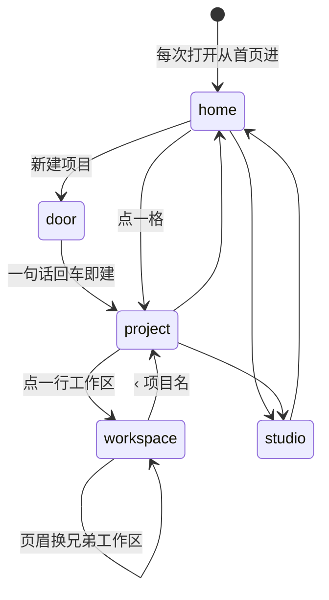
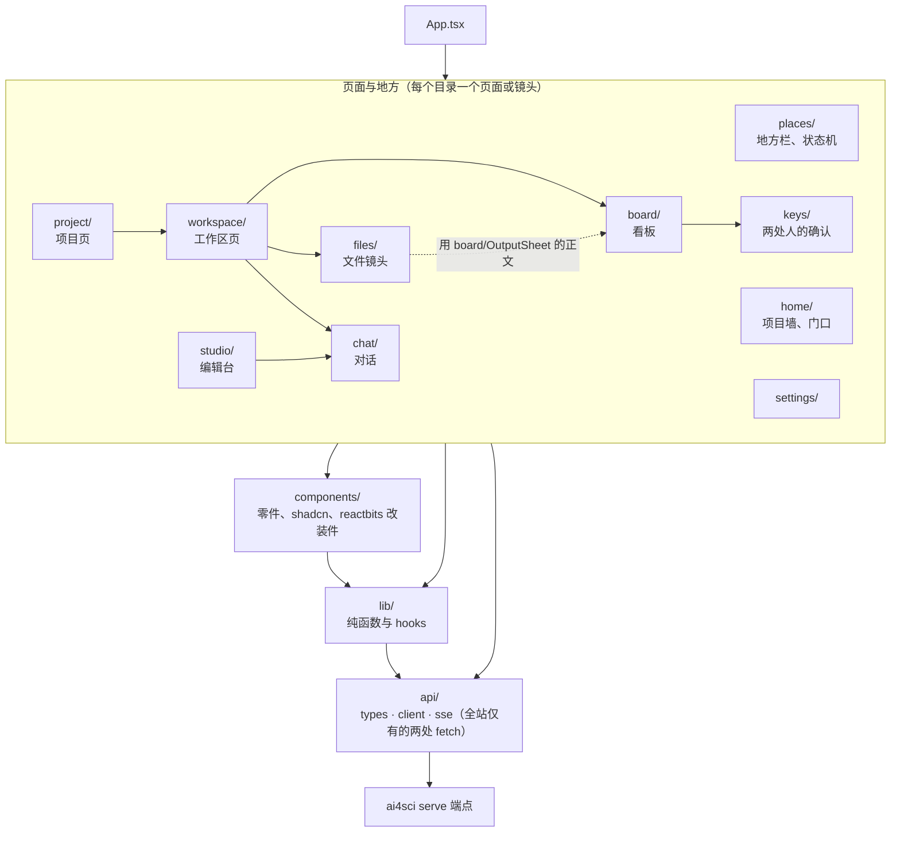

# ui/ · 界面层

平台的界面是**适配器**：一种界面一个目录，全部是 `ai4sci serve` 那些 HTTP 端点的客户端，互相不认识，也不认识框架内部。换一种界面就是加一个目录，后端一行不改。

| 目录 | 是什么 | 状态 |
|---|---|---|
| `web/` | 网页：React + Tailwind + shadcn，Vite 构建成静态文件，`ai4sci serve` 缺省端它 | 在用 |
| `tui/` | 终端界面：同一套端点的客户端，给只有 ssh 的场景 | 留位置，没建 |

这份写界面层的规矩：契约、技术栈、代码约定、测试政策、浏览器闭环。视觉与布局在 `../docs/DESIGN.md`，给谁用与原则在 `../docs/PRODUCT.md`，词表在外层纲领 `workflow.md` §5。

## 1. 契约：每种界面都只靠这些端点

端点清单在 `framework/chat/server.py` 文件头，响应体在 `framework/chat/boards.py`（那里是唯一出处，这里不抄）。端点按域分前缀（纲领 P-16）：`/projects/
/…` 是研究助理的域（工作区在它下面 `/projects/
/workspaces/<id>/…`），`/studio/…` 是流程助理的域，对话的五个端点两个域共用；`/settings` `/backends` `/health` `/stages` `/cap` `/skills` `/workflows` `/templates` 是全局的。

`web/src/api/` 是网页对这份契约的照抄：`types.ts` 响应体的类型、`client.ts` 每个端点一个函数（`Scope` 定域前缀；`WorkspaceClient` 是绑死在（项目，工作区）上的一组端点）、`sse.ts` 事件流（用 fetch 读 POST 返回的 SSE）。全站只有 `client.ts` 与 `sse.ts` 两处 `fetch`。写 TUI 时照它再抄一份。

加一个端点要登记三处：`server.py` 的清单与 `API_ROOTS`、`vite.config.ts` 的 `API_PREFIXES`（开发代理）、`api/types.ts` + `client.ts`。前后端契约只靠这几处注释同步，没有测试守（已知盲点）。

需求确认（`POST …/requirement/confirm`）与产出签字（`POST …/outputs/<stage>/<n>/sign`）是页面上「只有人能做」的两处；同一件事的 CLI（`ai4sci requirement confirm` / `sign`）在助理的会话里一律拒（`framework/cli/_common.py::refuse_if_assistant`）。

## 2. 技术栈

| 用什么 | 干什么 |
|---|---|
| React 19、TypeScript（`tsc -b`，strict + `noUnused*`）、Vite | 单页应用；不用路由（页面此刻在哪是 `places/place.ts` 的判别联合状态机，每次打开从首页进） |
| Tailwind v4（CSS-first，无 config 文件；tokens 在 `src/index.css`） | 样式；语义色 tokens，深色写两遍 |
| shadcn（radix-nova 预设，`radix-ui` 单包） | 基础件；生成件保持原样，只换图标 |
| `@phosphor-icons/react` | 全站唯一图标集（品牌标 `components/Logo.tsx` 与 `BrandIcon.tsx` 是仅有的自绘 SVG） |
| `motion` | 动效；`useReducedMotion` 下全部退化为直接出现 |
| `@xyflow/react` | 只在编辑台的画布 |
| `react-markdown` + `remark-gfm` + 自写 autolink 插件、`highlight.js` core 五种语言 | 助理的回复与文件镜头 |
| `eventsource-parser` | 读 POST 返回的 SSE |
| `cn`（npm 包）、`class-variance-authority`、`ogl`（只有 SpecularButton 用）、fontsource 字体 | |

**不引入的库**：路由、全局状态、取数缓存（tanstack-query）、axios、clsx、lucide。页面不读环境变量。依赖只进 `web/node_modules`，钉在 `package-lock.json`。

## 3. 代码约定

- **目录按页面与地方分**（`src/`）：`home/` 首页与门口、`project/` 项目页、`workspace/` 工作区页、`board/` 看板、`files/` 文件镜头、`chat/` 对话、`studio/` 编辑台、`keys/` 两处人的确认、`settings/` 设置、`places/` 地方栏与状态机、`components/` 零件（`ui/` shadcn 生成、`reactbits/` 改装件、`markdown/`）、`lib/` 纯逻辑与 hooks、`api/` 契约、`assets.ts` 素材 URL。每个目录的职责写在各文件的头注释里，文件清单以代码为准。
页面此刻在哪是 `places/place.ts` 的状态机（设置是压在任何地方上的悬浮板，不是一个地方）：

目录之间谁引谁（箭头 = import 方向；目录级没有环）：

- **依赖方向**（目录级没有环）：`App → home / project / studio / places / settings`；`project → workspace → board / files / chat`；`board → keys`；`studio → chat`；`files` 用 `board/OutputSheet` 的正文（横向）；`components` 只引 `lib` 与 `assets`，从不引 `api`；`lib` 可以引 `api`（`useChats`）。组件不直接 `fetch`。
- **计算下沉到纯函数模块**，组件只拼装：`board/derive.ts`、`project/derive.ts`、`files/derive.ts`、`studio/model.ts`、`chat/trace.ts`、`chat/turns.ts`、`settings/status.ts`、`lib/humanize.ts`、`lib/diff.ts`、`lib/slug.ts`、`lib/format.ts`。新逻辑先问能不能写成纯函数。
- **取数**：`lib/useResource` + `lastSeen`（模块级 Map，换地方不闪）+ `epoch`（每轮对话结束加一，看板重读）+ 只在有作业时每 10 秒轮询。
- **错误**：非 2xx 抛 `ApiError`，显示在 `ErrorNote`（`role=alert`）；静默 `catch` 必须写注释说明为什么可以不管；不留 `console.*`。
- **删除**一律 `HoldButton` 按住一秒生效，服务端返回 `{removed, leftovers}`；人的两处确认 `ConfirmKey` / `SignKey` 都要署名（`localStorage` 的 `ai4sci.signer`）。
- **素材**：图片 / 视频只写 CDN URL，只在 `assets.ts`；`git ls-files ui/` 里没有二进制（`make ui-check` 拦）。
- **文案**：只用词表里的词与后端给的中文名（能力 `title` `brief`、参数 `label`、阶段名、流程 `title`；产出 id 写「设计 · 1」）；机器的名字与状态码只在展开层；对话里的工具调用是例外，原样一行（`chat/trace.ts::toolLine`）。
- **命名与风格**：组件 PascalCase 具名导出；逻辑模块小写 `.ts`；hooks `useX`；测试同目录 `*.test.ts`；import 分三段（node / 第三方、`@/…`、相对）；单引号、不写分号；中文头注释写为什么、引用 P-n 与 issue。
- **reactbits 改装件**首行写来源、MIT、改了什么；颜色一律走 tokens，画布类组件用 `lib/tokens` 读颜色值并经 `themechange` 重读。

## 4. 测试政策

- vitest，node 环境，只收 `src/**/*.test.ts`（`*.test.tsx` 不会被收集，不要写）。
- **只测纯函数**：`derive` / `model` / `trace` / `turns` / `humanize` / `diff` / `slug` / `format` / `status` / `place` 各有单测；组件、hooks、api 层不写单元测试，靠浏览器闭环。
- **扫源码当 lint 的测试**：`copy.test.ts`（禁用词、退役词、`font-mono` 只许在文件镜头与代码块；先断言扫到 40 个以上文件，防空转）、`logo.test.ts`（页面里的标与 favicon 是同一条路径）、`assets.test.ts`（CDN origin）。
- `npm run check` = `tsc -b` + `oxlint`（只有 rules-of-hooks 是 error）+ `vitest run` + `vite build`；`make ui-check` 在它前面加素材检查，并入 `make check` 与 CI。没有覆盖率门槛。

## 5. 浏览器闭环

改了看得见的东西必须过浏览器再交：

1. 起两个进程：`ai4sci serve`（接口，8765，端出 `web/dist`）+ 改完 `npm run build` 重建（serve 直接端新构建；开发时也可 `npm run dev`，5173，接口按前缀代理）。改了指南前言要重启 serve（system prompt 起服务时读一次）。
2. 用 playwright（MCP）在真服务上点：起项目、确认需求、看板与文件镜头、编辑台拼流程与保存、设置检查；深色用 `document.documentElement.dataset.theme = 'dark'` 并触发 `themechange`；窄屏 `browser_resize`；减少动效用 `browser_emulate_media`。
3. 截图自己看一眼再交；截图只能存到外层仓根 `.playwright-mcp/`（gitignore），证据贴 issue 用文字描述加截图。
4. 对话相关的先 `ai4sci agent use <家> --for chat --model <便宜的模型>` 再跑两轮；别在测试里烧真实验。

## 6. 不做（第一版）

- 画布上的分叉 / 并行：流程是线性的一条链，节点一进一出；顺序 = 阅读顺序，人摆过的坐标存在文件的 `layout` 块里。
- 多用户、鉴权、token 级流式：后端是本机单人服务。
